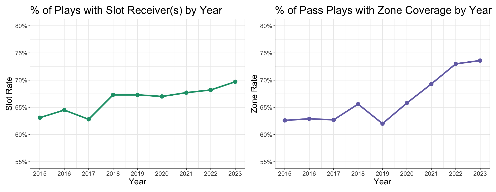

# Defending The Go-Gos: Predicting Slot Receiver Routes

### By Kevin Baer (Undergraduate Track Submission)

## Introduction

***"We Got The Beat"*** (1981), The Go-Go's most famous song, is an apt title for what this paper intends to accomplish. But who are The Go-Go's and what does "the beat" mean? Go-Go’s is a play on words for the two-way go optionality that makes defending slot receivers so hard in man coverage. And the goal here is to help defenses get the beat on these routes by predicting them using pre-snap indicators.

The following chart provides the motivation for this paper's topic.

Over the past decade, offenses have used more formations with slot receivers, and defenses have increased their zone coverage usage in a very similar manner. These are not the only two trends in the league, of course, but they are certainly large ones and likely at least somewhat related. Given that offense is largely proactive and defense is largely reactive, as well as some understanding of football schemes, it is reasonable to assume that the increase in zone coverage is, in part, because of the increase in slot receiver usage. But why and what can defenses do about it?

Why have defenses been playing less man? One reason is that defending slot receivers in man coverage is hard. Slot receivers are often off the line of scrimmage, so they can't be pressed. But more importantly, they usually have a "two-way go", option, or choice route, terms I'll use somewhat interchangeably to refer to routes where the receiver can choose which direction to go based on the defense. Against man, these routes become one-cut linear runaways based on the leverage of the CB, while against zone, they'll sit down in a hole.

Playing man coverage in the NFL on outside receivers is difficult enough even though you have the sideline and the longer throws to get the ball there. **To get *"The Beat"* on the Go-Gos, I used pre-snap indicators to predict the routes run by slot receivers against man coverage.**

## **Defining the Scope**

Data preparation is more important than any predictive algorithm. Here's what data made the cut.

All plays used were:

1.  between Week 1 and 9 of the 2022 NFL season (the full length of the given dataset)
2.  dropbacks
3.  man coverage
4.  not screen passes, trick plays, or spikes[^1]

[^1]:
    1.  As always, a shoutout to FTN and nflverse for their free play-level data.

To determine which players were classified as slot receivers, given we did not receive stance information nor is that easily calculable with this dataset, I used the following criteria.

Slot receivers must be:

1.  on offense
2.  in between the left and right-most offensive players
3.  running a route
4.  outside of 5 yards linearly from the football[^2]

[^2]:
    2.  (this cut out basically all TEs and RBs)

## Classifying Routes

The dataset does not include detailed information on which routes the player ran. This means we'll do it by hand, using the tracking data to determine the two critical parts of a route: direction and depth. A route going inside is very different when run at 5 vs. 15 yards, and likewise, a cut at 7 yards is difficult to defend when you don't know whether it'll be inside or outside.[^3]

[^3]:
    3)  Note the use of inside/outside versus left/right to treat routes on both sides of the field the same.

Here, we can see the route direction in action. The five skill position players, plus the QB and ball, are shown. We can see that the TE, outer receivers, and RB are not highlighted despite running routes, demonstrating the criteria above were successful. Jakobi Meyers, in the slot here, is running an inside-breaking route. By using his movement through space, we can classify his direction as vert (short for vertical) and then eventually inside, once he has maintained an inside cut angle (in this case between 235 and 315 degrees clockwise) for 0.5 seconds.

This frame-by-frame classification is then turned into one of four possible play directions: Inside, Outside, Vertical, or Both. If a route contains zero cuts, the entire route is on the vertical plane, and thus a vertical route. Some examples include curls, gos, and skinny posts. If a route solely contains vert and inside directions, it's an inside route – an In, drag, slant, and so on. Outside works the same, isolating outs, corners, and flat routes. Both means that a significant cut was taken inside and outside — returns, whips, and angle routes.

Now that we have classified the direction of the route, it's important to understand where the route break occurs. For our inside and outside breaking plays, there is a frame where the direction of the route first occurs — this represents where the route break starts.

Watch above and see how the start break only pops up once Meyers commits to the cut. This is purposeful; we don't want fakes or slight route widenings to mess with our data or results. We now have a direction – Inside – and depth – 9.15 – to describe this route. We'll build two separate machine-learning models to predict these characteristics.

## Feature Engineering

The goal is to predict break direction and depth from pre-snap indicators. I used five from the original dataset and four that were specifically created to improve accuracy. Here they are, as well as their values for the Jakobi Meyers play shown above:

1.  Offensive Team: NE

2.  Yards To Go: 10

3.  Absolute Yardline: 19

4.  Offense Formation: Shotgun

5.  Receiver Alignment: 3x1

    ------------------------------------------------------------------------

6.  Distance to Football: 11.24

7.  Distance to Outside Receiver: 8.07

8.  Cornerback X Alignment: 0.44

9.  Cornerback Y Alignment: 4.52

The four at the bottom represent the precise location of the slot receiver and the man-to-man defender (referred to as the slot corner). The slot corner's alignment is relative to the receiver, a positive x alignment indicating he's on the outside shoulder by 0.44 yards. The y alignment shows that he's playing about 5 yards of cushion off the receiver.

## Modeling Process and Example Play

Very briefly, I tested a variety of models, ensembles, and sets of variables. I chose the XGBoost model and conducted training and testing on data from weeks 1-7 with hyperparameter tuning, holding the weeks 8-9 data as a final test set. I primarily tracked the Area Under the Receiver Operating Characteristic Curve (ROC AUC) score for the categorical direction prediction, and the Root Mean Square Error (RMSE) for the numerical break depth prediction.

For the prediction of break direction:

1.  ROC AUC score of **.701** on test set for weeks 1-7
2.  ROC AUC score of **.639** on weeks 8-9

For the prediction of break depth:

1.  RMSE score of **3.99** yards on test set for weeks 1-7
2.  RMSE score of **4.17** yards on weeks 8-9

Here's a GIF of a play between the Chargers and Texans that demonstrates the pre-snap process and prediction values.

## Analysis

Besides the actual predictions, which could be useful in certain scenarios for a football staff, what else can we take away from this process to help win football games? To start, we'll use SHAP values to look at both DeAndre Carter and Gerald Everett's route break predictions for the above play.

We see that Carter is expected to run a shorter route than average due to his proximity to the outside receiver and the specific alignment of the cornerback. This is somewhat neutralized by him being farther away from the football than most slots, indicating he might be running a deeper route by about 0.6 of a yard. This leads to a projection of a route with a break at 2.36 yards.

Everett, on the other hand, is projected to break further downfield based on the cornerback's close alignment and being a far distance from his outside receiver. This provides useful information about the features that drive the predictions.

When looking at the model as a whole, I chose to use Permutation-Based Variable Importance to see which variables provided the most value.

### Permutation-Based Variable Importance for Route Depth

From this chart, we can see that by far the most important variable to the depth of the route is the distance from the football at the snap (basically how wide the receiver is), and then following are details about the cornerback alignment, yard line, yards to go, and distance to outside receiver.

### Permutation-Based Variable Importance for Route Direction

This chart shows similar categories for direction, but note that club becomes more important, and yard line and yards to go become less important. These variables demonstrate the differences between the two predictive models and provide clues into the patterns that can be drawn to predict slot routes.

Here's a YouTube video of the all-22:

And let's review those predictions:

|                             | Prediction           | Actual               |
|-----------------------------|----------------------|----------------------|
| DeAndre Carter (left slot)  | Outside / 2.36 yards | Outside / 2.85 yards |
| Gerald Everett (right slot) | Outside / 4.58 yards | Inside / 10.94 yards |

The Carter prediction is basically perfect. If an NFL cornerback knew at the snap that it was going to be an outside route at 2-3 yards of depth... The Everett prediction, however, illustrates a good example of an incorrect prediction. I purposefully picked this play to give both sides of the coin, but the model scores above paint a picture of how trustworthy this model is.

## Discussion and Further Work

In this paper, I have laid out a two-part model for predicting slot receiver routes (direction and depth) against man coverage. This allows defenses to fight back and attempt to play man coverage more often and more successfully, allowing for greater scheme diversity and success. We walked through detailed explanations, examples, model statistics, and variable importance. This is another tool in the toolbox for preparation and in-game adjustments.

However, there are some limitations of this work. Like any predictive model, there is always room for accuracy improvement. Furthermore, by relying on "at-snap" measurements, it's virtually impossible to communicate the findings to players on the field and the current model is too difficult to compute in one's head. Finally, on these choice routes, receivers don't make their final decisions at the snap. This could lead to situations where cornerbacks could use at-snap indicators to try to jump routes, but if it's too obvious, then the receiver can choose a different option. This would then impact future model outputs, meaning the model would need to be continuously changed to keep up with the "meta" of man-to-man coverage in the slot.

As far as further work, explorations into slot receivers versus zone coverage, team-by-team predictions, and more specific directional options (such as differentiating between a curl and a go route) would likely improve the scope, magnitude, and success of this analysis.

------------------------------------------------------------------------

## **Appendix**

By Kevin Baer, UCLA Second Year Undergraduate Student

Thank you so for much reading! I hope you enjoyed.

Please get in contact with me through my [LinkedIn](https://www.linkedin.com/in/kevinmbaer/) or <a href="mailto:kevinbaer@ucla.edu"> Email</a> with any questions or comments!

Citations, Code, and Commentary \@ my [Github](https://github.com/kevbaer/Defending_The_GoGos_BDB2025)!
